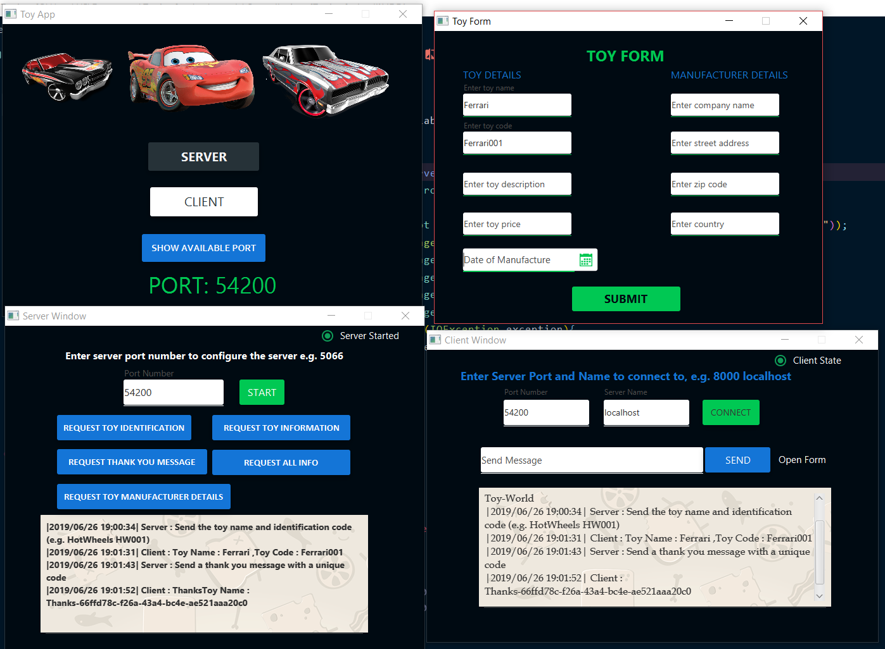
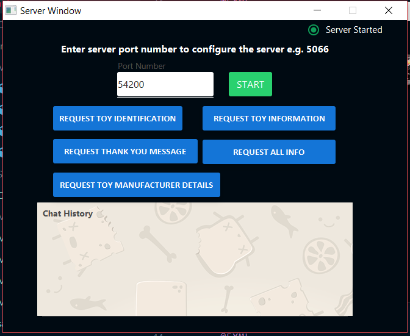

#TOY FX
##Java FX and Socket Programming

###Toy Fx is a simple Java FX application that implements socket programming, it allows two applications on the same or different PC's to communicate via objects.
### One pc acts as the server while the other acts as a client.
### The UI has been enhanced by a Java Fx Material Design Library called JFoenix.
### Feel free to clone the repo and play with it.
### ** NB: Configure the JFoenix library path to point to your pc, you can download the JAR file from https://github.com/jfoenixadmin/JFoenix. **

